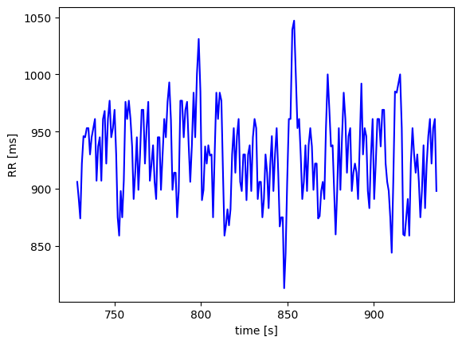
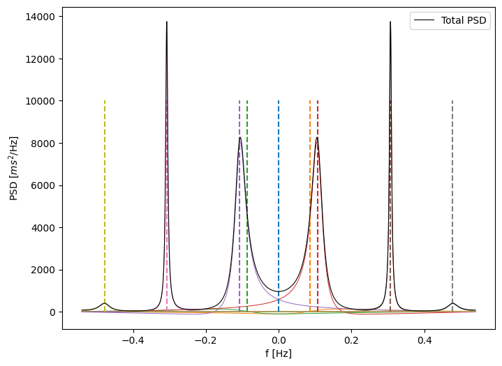
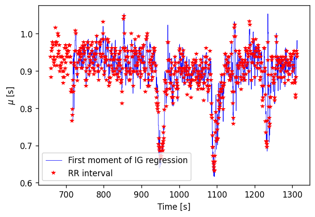
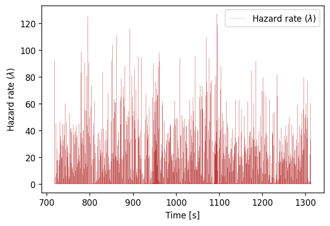
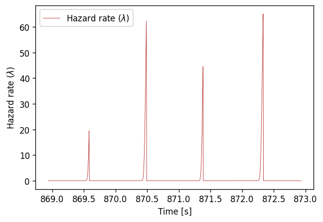
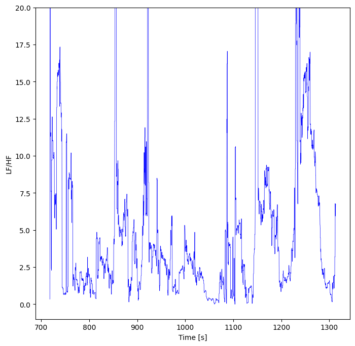
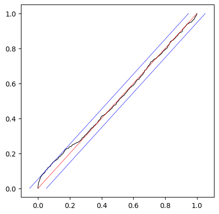

[](https://pointprocess.readthedocs.io/en/latest/?badge=latest)

[](https://codecov.io/github/andreabonvini/pointprocess?branch=master)


This repository contains a `C++` implementation of the `MATLAB` software provided by Riccardo Barbieri and Luca Citi [here](http://users.neurostat.mit.edu/barbieri/pphrv).

*Refer to the following papers for more details:*

- [*A point-process model of human heartbeat intervals: new definitions of heart rate and heart rate
  variability*](https://pubmed.ncbi.nlm.nih.gov/15374824/)
- [*The time-rescaling theorem and its application to neural spike train data
  analysis*](https://pubmed.ncbi.nlm.nih.gov/11802915/)

# Requirements

The project can be built with `CMake`, the only dependencies are [Eigen](https://eigen.tuxfamily.org)
and [Boost](https://www.boost.org).

Check [here](https://pointprocess.readthedocs.io/en/latest/installdependencies.html) for information on how to install these two packages.

# Documentation

The technical and scientific *documentation* for this repository is available [here](https://pointprocess.readthedocs.io/en/latest/). (WIP)

In order to build the project you should follow the instructions in the `build.sh` script.

## Quick Tour

This brief tutorial shows how to fit a history-dependent *Inverse Gaussian* point process model to a temporal series of RR events.

You can find this example as a Jupyter Notebook in the `examples/` directory.

Note: In order to call the Python bindings you need to first build the library.

```python
# Basic imports
import sys
import os
import numpy as np
import matplotlib.pyplot as plt

# Path to the generated .so library (MacOs or Linux) or .dll (Windows)
# Should be "build/src/" if you built the project with build.sh
PATH_TO_LIB = "path/to/library/" 

sys.path.append(PATH_TO_LIB)

# Now we can import the Python byndings from the pointprocess library
from pointprocess import (
    compute_single_regression,
    compute_full_regression,
    compute_spectral_analysis,
    Distributions,
    Result,
    RegressionResult,
    get_ks_coords
)
```

```python
# Example: load and plot a series of RR events
rr = np.load("events.npy")
events = np.array(rr[75:301])
plt.plot(events[1:], 1000*np.diff(events),"b")
plt.xlabel('time [s]')
plt.ylabel('RR [ms]')
```



### Single Regression

```python
# Compute single regression on a subset of the RR intervals
result_single_regression = compute_single_regression(
    events = rr[75:301],
    ar_order = 9,
    has_theta0 = True,
    right_censoring = False,
    alpha = 0.02,
    distribution=Distributions.InverseGaussian,
    max_iter=10000
    )

# You can now access to elements as:
# result_single_regression.thetap
# result_single_regression.theta0
# result_single_regression.kappa
# result_single_regression.likelihood
# result_single_regression.mean_interval

```

#### Get Spectral info

```python
thetap = result_single_regression.thetap
mean_interval = result_single_regression.mean_interval
kappa = result_single_regression.kappa
variance = result_single_regression.sigma**2


# Retrieve spectral info
analysis = compute_spectral_analysis(thetap, mean_interval, variance, aggregate=False)

# Plot stuff
plt.figure(figsize=(8,6),dpi=100)
colors = []
for comp in analysis.comps:
    p = plt.plot(analysis.frequencies, np.real(comp),linewidth=0.7)
    colors.append(p[-1].get_color())
    
for i in range(len(analysis.poles)):
    plt.vlines(analysis.poles[i].frequency,0,10000,colors[i],"--")
    
plt.plot(analysis.frequencies, analysis.powers, "k-",linewidth=0.8,label="Total PSD")
plt.xlabel("f [Hz]")
plt.ylabel("PSD [$ms^2$/Hz]")
plt.legend()
```



### Full Regression

```python
# Fit Inverse Gaussian distribution to RR by moving a 60.0 seconds windows and shifting it by 0.005 s at each step.
# The mean of the ditribution will bi given by a 9th order AR model
result = compute_full_regression(
    events=rr,
    window_length=60.0,
    delta=0.005,
    ar_order=9,
    has_theta0=True,
    right_censoring=True,
    alpha = 0.02,
    distribution=Distributions.InverseGaussian,
    max_iter = 1000
)

# Compute spectral info
result.compute_hrv_indices()

# Convert result to dictionary...
d = result.to_dict()
```

```python
# Plot first moment of the distribution in time, along with the discrete RR intervals 
plt.figure(figsize=(6,4),dpi=120)
plt.plot(d["Time"],d["Mu"],"b",linewidth=0.5,label="First moment of IG regression")
plt.xlabel("Time [s]")
plt.ylabel("$\mu$ [s]")
plt.plot(rr[1:],np.diff(rr),"r*",mew=0.01,label="RR interval")
plt.legend()
```



```python
# Plot hazard rate
plt.figure(figsize=(6,4),dpi=120)
plt.plot(d["Time"],d["lambda"],"firebrick",linewidth=0.15,label="Hazard rate ($\lambda$)")
plt.xlabel("Time [s]")
plt.ylabel("Hazard rate ($\lambda$)")
plt.legend()

# Same but just for a smaller number of samples...
plt.figure(figsize=(6,4),dpi=120)
s,e = 30200,31000
plt.plot(d["Time"][s:e],d["lambda"][s:e],"firebrick",linewidth=0.5,label="Hazard rate ($\lambda$)")
plt.xlabel("Time [s]")
plt.ylabel("Hazard rate ($\lambda$)")
plt.legend()
```





```python
# Plot LF/HF ration
plt.figure(figsize=(8,8))
bal = d["powLF"] / d["powHF"]
plt.plot(d["Time"],bal,"blue",linewidth=0.5)
plt.ylim(-1,20)
plt.ylabel("LF/HF")
plt.xlabel("Time [s]")
```



```python
# Build KS plot to assess goodness of fit
coords = get_ks_coords(result.taus)
plt.figure(figsize=(5,5),dpi=100)
plt.plot(coords.z, coords.inner, "k", linewidth=0.8)
plt.plot(coords.lower, coords.inner, "b", linewidth=0.5)
plt.plot(coords.upper, coords.inner, "b", linewidth=0.5)
plt.plot(coords.inner, coords.inner, "r", linewidth=0.5)
```


