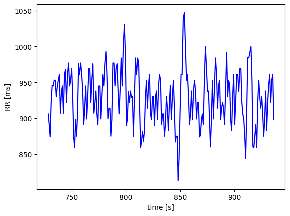
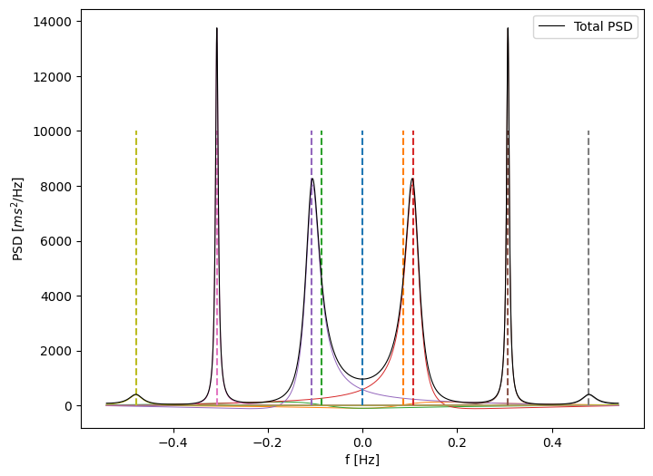
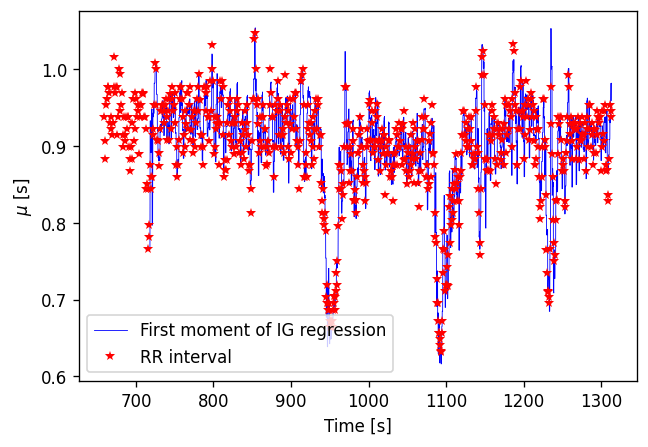

[](https://pointprocess.readthedocs.io/en/latest/?badge=latest)

[](https://codecov.io/github/andreabonvini/pointprocess?branch=master)


# Point Process

A modern C++ implementation of point process models for heart rate variability (HRV) analysis. Based on the MATLAB software by Riccardo Barbieri and Luca Citi ([http://users.neurostat.mit.edu/barbieri/pphrv](http://users.neurostat.mit.edu/barbieri/pphrv)).

**Key Features:**
- Fast C++ implementation with Python bindings
- Multiple distribution models (Inverse Gaussian, Gaussian, LogNormal)
- State-space regression and spectral analysis
- Easy-to-use Python API with NumPy/SciPy integration
- Cross-platform support (Linux, macOS, Windows)
- Distributed as pre-built wheels via PyPI

**Reference Papers:**
- [A point-process model of human heartbeat intervals: new definitions of heart rate and heart rate variability](https://pubmed.ncbi.nlm.nih.gov/15374824/)
- [The time-rescaling theorem and its application to neural spike train data analysis](https://pubmed.ncbi.nlm.nih.gov/11802915/)

## Installation

### From PyPI (Recommended)

```bash
pip install pointprocess
```

Supported platforms:
- Linux (x86_64)
- macOS (x86_64, ARM64)
- Windows (x86_64)
- Python 3.9–3.12

### Development Setup

All development work uses **nox** for consistency across platforms. First install system dependencies:

**macOS (Homebrew):**
```bash
brew install cmake boost eigen
```

**Linux (Ubuntu/Debian):**
```bash
sudo apt-get install -y cmake libboost-all-dev libeigen3-dev
```

**Linux (Fedora/RHEL):**
```bash
sudo dnf install -y cmake boost-devel eigen3-devel
```

**Windows (Chocolatey):**
```bash
choco install cmake boost-msvc-14.3 eigen
```

Then clone and use nox:

```bash
git clone https://github.com/andreabonvini/pointprocess.git
cd pointprocess
pipx install nox
nox
```

### Common Development Tasks

All tasks use nox (no more bash scripts):

```bash
nox -s dev           # Set up development environment
nox -s build         # Build C++ extension
nox -s test          # Run test suite
nox -s lint          # Code quality checks (clang-format)
nox -s coverage      # Generate coverage report
nox -s docs          # Build Sphinx documentation
nox -s clean         # Clean build artifacts
```

## Documentation

Full documentation available at [pointprocess.readthedocs.io](https://pointprocess.readthedocs.io/en/latest/)

## Quick Start

### Basic Usage

```python
import numpy as np
import matplotlib.pyplot as plt
from pointprocess import (
    compute_single_regression,
    compute_full_regression,
    compute_spectral_analysis,
    Distributions,
)

# Load RR interval data (time between heartbeats in seconds)
rr = np.load("events.npy")
events = rr[75:301]

# Plot RR intervals
plt.plot(events[1:], 1000 * np.diff(events), "b")
plt.xlabel("Time [s]")
plt.ylabel("RR [ms]")
plt.show()
```



### Single Regression

Fit a point process model to a fixed window of data:

```python
result = compute_single_regression(
    events=events,
    ar_order=9,
    has_theta0=True,
    right_censoring=False,
    alpha=0.02,
    distribution=Distributions.InverseGaussian,
    max_iter=10000
)

# Access results
print(f"AR coefficients (θ_p): {result.thetap}")
print(f"Intercept (θ_0): {result.theta0}")
print(f"Shape parameter (κ): {result.kappa}")
print(f"Log-likelihood: {result.likelihood}")
print(f"Mean interval: {result.mean_interval}")
```

### Spectral Analysis

```python
# Compute power spectral density from model parameters
analysis = compute_spectral_analysis(
    thetap=result.thetap,
    mean_interval=result.mean_interval,
    variance=result.sigma ** 2
)

# Plot power spectral density
plt.figure(figsize=(10, 6))
plt.plot(analysis.frequencies, analysis.powers, "k", linewidth=0.8)
for pole in analysis.poles:
    plt.axvline(pole.frequency, color="r", linestyle="--", alpha=0.3)

plt.xlabel("Frequency [Hz]")
plt.ylabel("Power [ms²/Hz]")
plt.xlim(0, 0.5)
plt.show()
```



### Full Regression (Time-Varying Analysis)

```python
# Fit model across time with sliding window
result_full = compute_full_regression(
    events=rr,
    window_length=60.0,      # 60 second window
    delta=0.005,             # 5 ms step size
    ar_order=9,
    has_theta0=True,
    right_censoring=True,
    alpha=0.02,
    distribution=Distributions.InverseGaussian,
    max_iter=1000
)

# Convert to dictionary for easier access
d = result_full.to_dict()

# Plot time-varying mean
plt.figure(figsize=(12, 4))
plt.plot(d["Time"], d["Mu"], "b", linewidth=0.5, label="μ(t)")
plt.xlabel("Time [s]")
plt.ylabel("Mean Interval [s]")
plt.legend()
plt.show()
```



For complete examples with visualizations, see the Jupyter Notebook in `examples/`.

## Contributing

We welcome contributions! Please:

1. Fork the repository
2. Create a feature branch
3. Make your changes
4. Run tests: `nox -s test`
5. Submit a pull request

## License

MIT License - See [LICENSE](LICENSE) file for details.

## Citation

If you use this library in your research, please cite:

```bibtex
@software{pointprocess2026,
  author = {Bonvini, Andrea},
  title = {Point Process: Heart Rate Variability Analysis Library},
  url = {https://github.com/andreabonvini/pointprocess},
  year = {2026}
}
```
