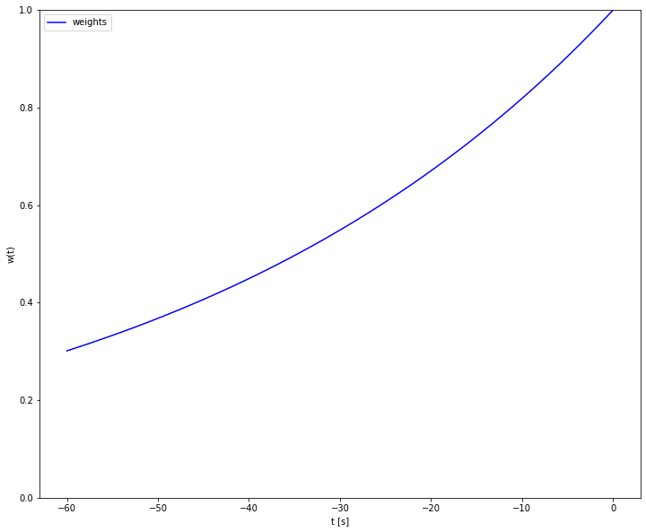
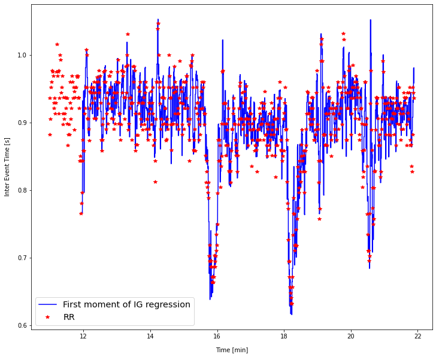
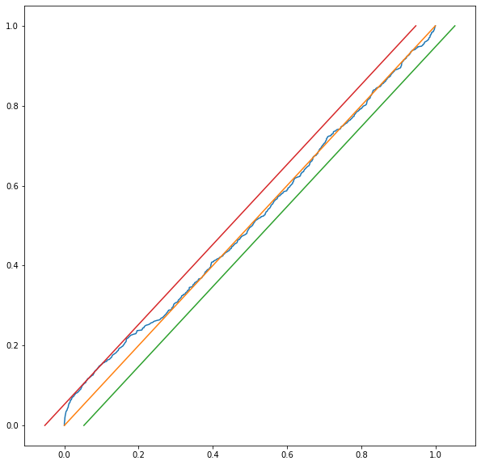
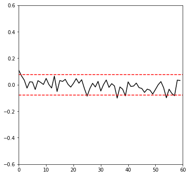
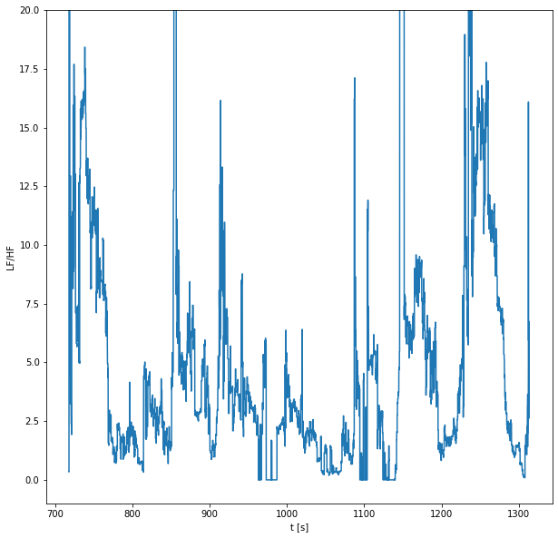

A C++ Library for Point Process analysis.
==========================================

.. toctree::
   :maxdepth: 2
   :caption: Basic info:

   license
   help

.. toctree::
   :maxdepth: 1
   :caption: Installation:

   installdependencies
   buildwithcmake

   
.. toctree::
   :maxdepth: 2
   :caption: Scientific Documentation:

   Gradients-and-Hessians
   inhomogenouspoisson
   hazardfunction

.. toctree::
   :maxdepth: 2
   :caption: Code Documentation:

   weightsproducer
   dataset
   optimizer
   regressionpipeline
   spectralanalysis
   serialize

************
Quick Guide
************

Once you have installed the needed dependencies and built the project through CMake, you can call the main function `regr_likel` from Python by following these instructions:

Setup Python environment (e.g. in Jupyter)
###########################################

.. code-block::

    Supposing you have the following folder structure:

    ├──-pp
    │   ├───pointprocess
    │   └───notebooks

    If you create a .ipynb in the "notebooks" folder, you can setup your environment by simply running the following cell:

.. code-block:: python

    import sys
    PATH = "../pointprocess/"  # path of pointprocesslib.py
    sys.path.append(PATH)
    from pointprocesslib import regrlikel, check_corr, compute_psd,hrv_indices, ks_distance, InterEventDistribution

Example of use
###############
In order to follow this brief example you should download `rr.csv` from `this`_  link and put it under the `notebooks/` directory.

.. _this: https://drive.google.com/file/d/1AryZY7PDXgP19UC11eHzxq2bnMKkEjsy/view?usp=sharing

.. code-block:: python

    import os
    import matplotlib.pyplot as plt
    import numpy as np

    OUTPUT_DIR = "outputs"
    if not os.path.exists(OUTPUT_DIR):
        os.mkdir(OUTPUT_DIR)
    OUTPUT_DATA = os.path.join(OUTPUT_DIR,"InverseGaussianHRVData.csv")
    OUTPUT_TAUS = os.path.join(OUTPUT_DIR,"InverseGaussianHRVTaus.csv")

    # Load events...
    events = np.array(pd.read_csv("rr.csv")["RR"])

    WINDOW_LENGTH = 60.0
    AR_ORDER = 9
    DELTA = 0.005
    ALPHA = 0.02
    DISTRIBUTION = InterEventDistribution.InverseGaussian

    # Draw exponential weight decay along WINDOW_LENGTH
    # (this is useful to understand if you have chosen a reasonable value for ALPHA.
    number_of_samples = 50
    # times represent the distance from the current time wt
    times = np.linspace(-WINDOW_LENGTH, 0, number_of_samples)
    weights = np.exp(ALPHA*times)

    plt.figure(figsize=(12,10))
    plt.plot(times,weights,color = "blue", label = "weights")
    plt.xlabel("t [s]")
    plt.ylabel("w(t)")
    plt.ylim([0,1])
    plt.legend()

.. code-block:: python

    # Start regression (computation time is currently circa 20 s for 10 minutes of data with delta = 0.005 ms)
    regrlikel(
                events = events,
                window_length = WINDOW_LENGTH,
                delta = DELTA,
                ar_order = AR_ORDER,
                has_theta0 = True,
                alpha = ALPHA,
                distribution = DISTRIBUTION,
                right_censoring = True,
                output_taus_path = OUTPUT_TAUS,
                output_data_path = OUTPUT_DATA
             )

.. code-block:: python

    # Load results...
    taus = pd.read_csv(OUTPUT_TAUS)["Taus"]
    data = pd.read_csv(OUTPUT_DATA)
    # Plot Mu
    fig, ax = plt.subplots(figsize=(12, 10))
    ax.plot(data["Time"] / 60.0, data["Mu"], label='First moment of IG regression', color='blue')
    ax.plot(events[1:] / 60.0, np.diff(events), "*", label='RR', color='red')
    ax.legend(loc='best', fontsize='x-large')
    plt.xlabel("Time [min]", loc="center", labelpad = 12)
    plt.ylabel("Inter Event Time [s]", loc = "center", labelpad = 12)

.. code-block:: python

    # Compute KS distance and build KS Plot
    ksd = ks_distance(taus, plot=True)  # ksd: 0.03875

.. code-block:: python

    # Check correlation
    plt.figure(figsize=(6,6))
    check_corr(np.array(taus))

.. code-block:: python

    # Compute spectral features.

    """
    The computation of the spectral features is extremely slow for now, the code should be ported completely in C++ and called through additional Python bindings.
    Note that hrv_indices() returns an HeartRateVariabilityIndices object (see pointprocesslib.py for more details):

    @dataclass
    class HeartRateVariabilityIndices:
        powVLF: float
        powLF: float
        powHF: float
    """

    indices  = [
        hrv_indices(
            compute_psd(
                np.array(data.iloc[i]["Theta1":]),
                data.iloc[i]["meanInterval"],
                data.iloc[i]["Sigma"]**2.0
            )
        ) for i in range(len(data))
    ]

    plt.figure(figsize=(10,10))
    plt.plot(data["Time"],[i.powLF/i.powHF for i in indices])
    plt.ylim([-1,20])
    plt.xlabel("t [s]")
    plt.ylabel("LF/HF")

